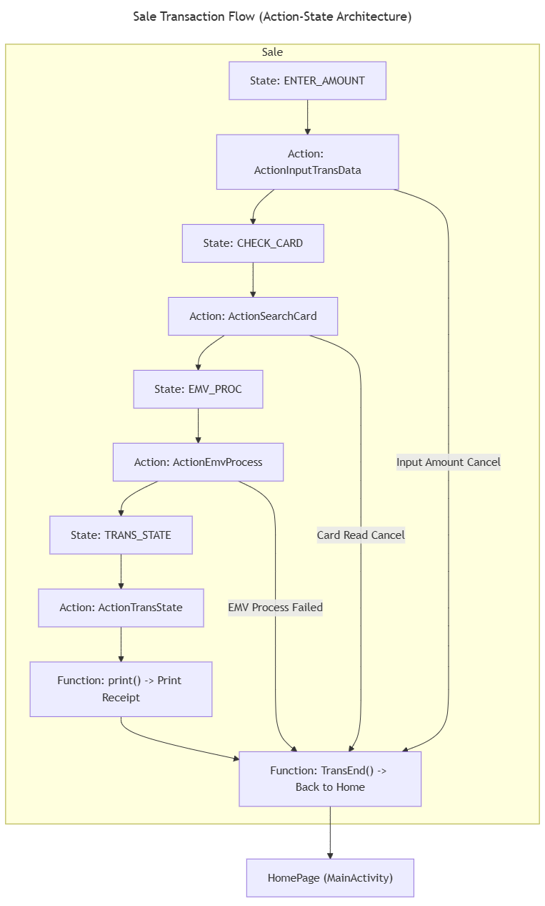
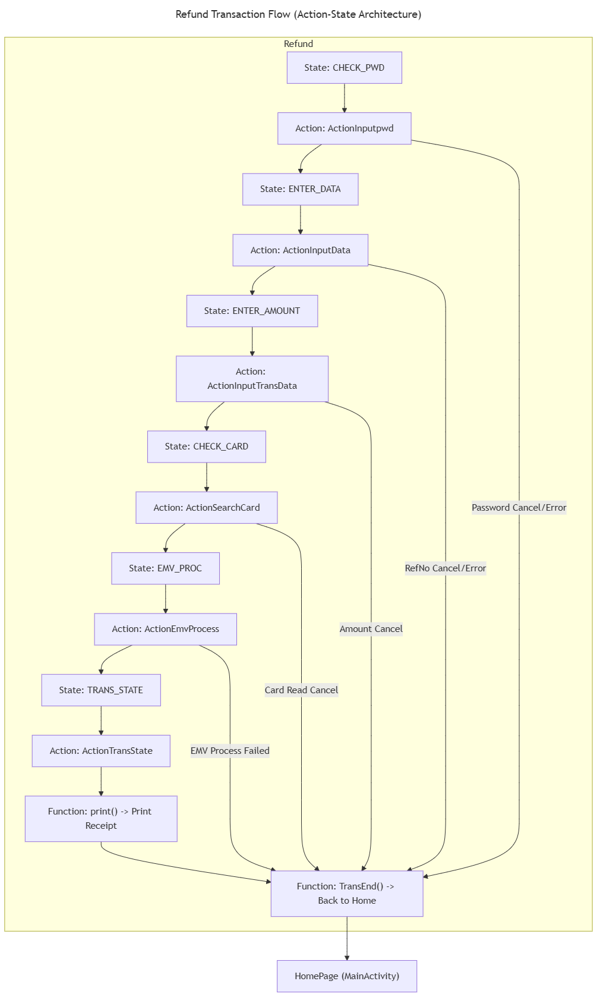
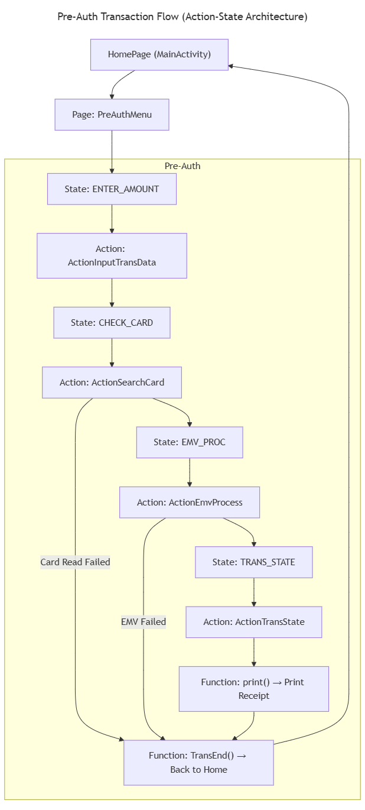
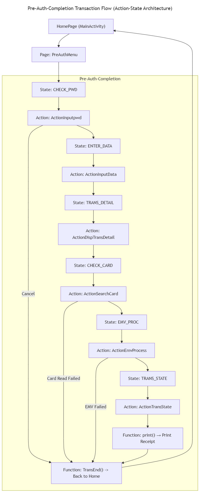
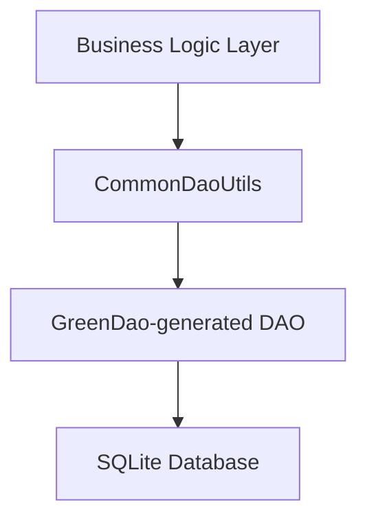

# 💳 PremierPay APP Project Development Document
- [💳 PremierPay APP Project Development Document](#-premierpay-app-project-development-document)
  - [1. Project Overview](#1-project-overview)
  - [2. Technical architecture](#2-technical-architecture)
    - [2.1 Architecture diagram](#21-architecture-diagram)
  - [3. Supported Transaction Types](#3-supported-transaction-types)
    - [3.1 Transaction Type List](#31-transaction-type-list)
    - [3.2 Transaction Parameter Configuration](#32-transaction-parameter-configuration)
    - [3.3 Code Structure Example](#33-code-structure-example)
  - [4. Supported Card Types](#4-supported-card-types)
  - [5. Module Architecture](#5-module-architecture)
  - [6. State Control Flow (Action-State Architecture)](#6-state-control-flow-action-state-architecture)
    - [6.1 Transaction Workflow States](#61-transaction-workflow-states)
    - [6.2 Transaction Status Definitions](#62-transaction-status-definitions)
    - [6.3 EMV Processing Steps](#63-emv-processing-steps)
    - [6.4 Implementation Architecture](#64-implementation-architecture)
      - [6.4.1 Action Component Classification](#641-action-component-classification)
      - [6.4.2 Activity Interface Component](#642-activity-interface-component)
      - [6.4.3 Specific Transaction Workflow](#643-specific-transaction-workflow)
        - [6.4.3.1 Sale Transaction Workflow](#6431-sale-transaction-workflow)
        - [6.4.3.2 Refund Transaction Workflow](#6432-refund-transaction-workflow)
        - [6.4.3.3 Pre-Auth Transaction Workflow](#6433-pre-auth-transaction-workflow)
        - [6.4.3.4 Pre-Auth-Completion Transaction Workflow](#6434-pre-auth-completion-transaction-workflow)
        - [6.4.3.5 Pre-Auth-Cancellation Transaction Workflow](#6435-pre-auth-cancellation-transaction-workflow)
  - [7. Network Communication Specification](#7-network-communication-specification)
    - [7.1 Communication Configuration](#71-communication-configuration)
    - [7.2 Message Definition \& Packaging](#72-message-definition--packaging)
      - [7.2.1 Message Template Loading](#721-message-template-loading)
      - [7.2.2 Message Template Loading Code](#722-message-template-loading-code)
      - [7.2.3 Message Pack/Unpack Implementations](#723-message-packunpack-implementations)
    - [7.2.4 Message Packaging Process](#724-message-packaging-process)
      - [7.2.5 Message Unpacking Process](#725-message-unpacking-process)
    - [7.3 API Endpoint Specification](#73-api-endpoint-specification)
      - [7.3.1 Communication Implementation](#731-communication-implementation)
    - [7.3.2 Backend Response Code Implementation](#732-backend-response-code-implementation)
  - [8.Core Interface Technical Specifications](#8core-interface-technical-specifications)
    - [8.1 APP - EMV Processing Interface](#81-app---emv-processing-interface)
      - [8.1.1 Interface Method Details](#811-interface-method-details)
    - [8.1.2 ActionEmvProcess - EMV Process Handling](#812-actionemvprocess---emv-process-handling)
  - [9.Security and Encryption System Key Module](#9security-and-encryption-system-key-module)
    - [9.1 Key Module](#91-key-module)
    - [9.2 Security Mechanisms](#92-security-mechanisms)
    - [9.3 Encryption Technical Details](#93-encryption-technical-details)
      - [9.3.1 Master Key Injection Interface](#931-master-key-injection-interface)
      - [9.3.2 PIN Key Injection Interface](#932-pin-key-injection-interface)
      - [9.3.3 MAC Key Injection Interface](#933-mac-key-injection-interface)
      - [9.3.4 Encrypted PIN Block Acquisition Interface](#934-encrypted-pin-block-acquisition-interface)
      - [9.3.5 Encrypted MAC Calculation Interface](#935-encrypted-mac-calculation-interface)
      - [9.3.6  Key Index Management](#936--key-index-management)
  - [10.Parameter Configuration Module](#10parameter-configuration-module)
    - [10.1 Terminal Parameters](#101-terminal-parameters)
    - [10.2 AID, CAPK and Other Parameter Management Files](#102-aid-capk-and-other-parameter-management-files)
      - [10.2.1 AID Parameter Configuration](#1021-aid-parameter-configuration)
      - [10.2.2 CAPK Parameter Configuration](#1022-capk-parameter-configuration)
    - [10.3 Parameter Loading and Storage Framework](#103-parameter-loading-and-storage-framework)
      - [10.3.1 Base Loading Class (LoadParam)](#1031-base-loading-class-loadparam)
      - [10.3.2 AID Parameter Management (AidParam)](#1032-aid-parameter-management-aidparam)
      - [10.3.3 CAPK Parameter Management (CapkParam)](#1033-capk-parameter-management-capkparam)
      - [10.3.4 Application Combination Management (AppCombinationHelper)](#1034-application-combination-management-appcombinationhelper)
    - [10.4 System Parameters](#104-system-parameters)
      - [10.4.1 Parameter Storage Architecture](#1041-parameter-storage-architecture)
      - [10.4.2 Parameter Key Name Management](#1042-parameter-key-name-management)
      - [10.4.3 Core Parameter Types](#1043-core-parameter-types)
      - [10.4.4 Parameter Operation Methods](#1044-parameter-operation-methods)
      - [10.4.5 Data Persistence Mechanism](#1045-data-persistence-mechanism)
    - [10.5 Parameter Management Process](#105-parameter-management-process)
  - [11.Database Design (GreenDao)](#11database-design-greendao)
    - [11.1 Data Table Definitions](#111-data-table-definitions)
      - [11.1.1 Main Transaction Table: `TRANS_DATA`](#1111-main-transaction-table-trans_data)
    - [11.1.2 Reversal Table: `DUP_TRANSDATA`](#1112-reversal-table-dup_transdata)
    - [11.1.3 Statistics Table: `TOTA_TRANSDATA`](#1113-statistics-table-tota_transdata)
    - [11.2 Data Access Interface Examples](#112-data-access-interface-examples)
      - [11.2.1 DAO Utility Class Architecture](#1121-dao-utility-class-architecture)
      - [11.2.2 Database Operation Usage Example](#1122-database-operation-usage-example)
    - [11.3 Database Upgrade](#113-database-upgrade)
    - [11.4 Design Specification Summary](#114-design-specification-summary)
  - [12. Code Structure Description](#12-code-structure-description)
    - [12.1 Main Application Module (app)](#121-main-application-module-app)
      - [12.1.1 app Directory Structure](#1211-app-directory-structure)
        - [12.1.1.1 Core Architecture Layer](#12111-core-architecture-layer)
        - [12.1.1.2 Data Persistence Layer](#12112-data-persistence-layer)
        - [12.1.1.3 User Interface Layer](#12113-user-interface-layer)
        - [12.1.1.4 Business Function Layer](#12114-business-function-layer)
        - [12.1.1.5 Resource Files](#12115-resource-files)
    - [12.2 Location Module (topAmapLbs)](#122-location-module-topamaplbs)
    - [12.3 Image Utility Module (topImage)](#123-image-utility-module-topimage)
      - [12.3.1 Module Overview](#1231-module-overview)
      - [12.3.2 Integration Configuration](#1232-integration-configuration)
    - [12.4 Custom Dialog Module (topkDialog)](#124-custom-dialog-module-topkdialog)
      - [12.4.1 Module Overview](#1241-module-overview)
      - [12.4.2 Integration Configuration](#1242-integration-configuration)
      - [12.4.3 Core Components](#1243-core-components)
      - [12.4.4 Usage Methods](#1244-usage-methods)
    - [12.5 EMV Process Module (topManager)](#125-emv-process-module-topmanager)
      - [12.5.1 Module Overview](#1251-module-overview)
      - [12.5.2 Integration Configuration](#1252-integration-configuration)
      - [12.5.3  Core Functions](#1253--core-functions)
        - [12.5.3.1 Card Management (card package)](#12531-card-management-card-package)
        - [12.5.3.2 EMV Processing](#12532-emv-processing)
        - [12.5.3.3 Device Management](#12533-device-management)
    - [12.6 Utility Module (toptool)](#126-utility-module-toptool)
      - [12.6.1 Module Overview](#1261-module-overview)
      - [12.6.2 Integration Configuration](#1262-integration-configuration)
      - [12.6.3 Core Functions](#1263-core-functions)
      - [12.6.4 Core Utility Class Description](#1264-core-utility-class-description)
      - [12.6.5 Usage Examples](#1265-usage-examples)
  - [13.Integration steps](#13integration-steps)

## 1. Project Overview
- **APP Name**：PremierPay
- **APP Type**：POS terminal dedicated chip card transaction application
- **Development Language**：Java
- **Deploy Platform**：Android POS device
- **Target**：Implement the EMV standard chip card transaction process, support online communication with the background server, and complete various payment transactions.

---
## 2. Technical architecture

- **Language & Platform**：Java + Android SDK
- **Network communication**：OKHttp3（Used for online transactions and backend interactions）
- **Database**：GreenDao（On-premises data persistence）
- **Architecture patterns**：Action-State control flow architecture for transaction flows
- **Backend connection**：TCP/HTTP communication is established over IP + PORT
- **Security mechanisms**：
    - Support Master/Slave key management

### 2.1 Architecture diagram
```
┌─────────────────┐    ┌─────────────────┐    ┌─────────────────┐
│    UI Layer     │ ←→ │  Business Layer │ ←→ │   Data Layer    │
│   Activities    │    │  Action/State   │    │   GreenDao      │
│                 │    │    Manager      │    │    OkHttp       │
└─────────────────┘    └─────────────────┘    └─────────────────┘
                              ↓
┌─────────────────────────────────────────────────────────────┐
│                    Backend Server                           │
│                 (TCP/IP Connection)                         │
└─────────────────────────────────────────────────────────────┘
```

---

## 3. Supported Transaction Types
**Transaction type definition file**
> File: [ETransType.java](app/src/main/java/com/topwise/premierpay/trans/model/ETransType.java)

**Function**: Define the transaction types supported by the application and the corresponding ISO8583 message parameter configurations.

### 3.1 Transaction Type List

| Type                                    | Description            | ETransType            |
|-----------------------------------------|------------------------|-----------------------|
| `Sale`（Purchase）                          | Sale Transaction       | `TRANS_SALE`          |
| `Refund`（Refund）                          | Refund Transaction     | `TRANS_REFUND`        |
| `Pre-Auth`（PreAuth）                       | Authorization Hold     | `TRANS_PRE_AUTH`      |
| `Pre-Auth-Completion`（PreAuth Completion） | Capture                | `TRANS_PRE_AUTH_CMP`  |
| `Pre-Auth-Cancellation`（PreAuth Cancel）   | Authorization Reversal | `TRANS_PRE_AUTH_VOID` |
| `Reversal`（Reversal）                      | Reversal Processing    |      Automatically triggered by the transaction flow, no explicit enumeration              |

### 3.2 Transaction Parameter Configuration
**Core Parameter Specifications**
- **Message Type**: Identifies the message class and function (e.g., 0200 for Financial Transaction Request).
- **Reversal Message Type**: Specifies the message type for transaction reversal (e.g., 0420 for Reversal Request).
- **Processing Code**: Defines the transaction type and account selection (e.g., 000000for Purchase, 200000for Refund).
- **Service Code**: Indicates the service conditions and point of service environment.
- **Net Code**: Identifies the acquiring and card issuer network.

### 3.3 Code Structure Example
Code structure example
```java
public enum ETransType {
  TRANS_SALE("0200", "0420", "000000", "00", "22", "000", TopApplication.mApp.getString(R.string.title_sale), true, true, false) {
    @Override
    public PackIso8583 getpackager(PackListener listener) {
      return new PackCousume(listener);
    }
    @Override
    public PackIso8583 getDupPackager(PackListener listener) {
      return new PackReveral(listener);
    }
    @Override
    public PackJson getpackJsonager(PackListener listener) {
      return null;
    }
    @Override
    public PackJson getDupPackJsonager(PackListener listener) {
      return null;
    }
  },;
    private String msgType;
    private String dupMsgType;
    private String procCode;
    private String serviceCode;
    private String funcCode;
    private String netCode;
    private String transName;
    private boolean isDupSend;
    private boolean isScriptSend;
    private boolean isOfflineSend;
    /**
     *
     * @param msgType
     *            ：Message Type
     * @param dupMsgType
     *            :Reversal Message Type
     * @param procCode
     *            : DE 3 Processing
     * @param serviceCode
     *            ：DE 25 Service Code
     * @param funcCode
     *            ：DE 60.1 Function code
     * @param netCode
     *            ：DE 24 NII(Network International Identifier) 
     * @param transName
     *            :Transaction Name
     * @param isDupSend
     *            ：Is Reversal Send
     * @param isScriptSend
     *            ：Is Script Upload
     * @param isOfflineSend
     *            ：Is Offline Transaction Upload 
     */
    private ETransType(String msgType, String dupMsgType, String procCode, String serviceCode, String funcCode, String netCode, String transName, boolean isDupSend, boolean isScriptSend, boolean isOfflineSend) {
        this.msgType = msgType;
        this.dupMsgType = dupMsgType;
        this.procCode = procCode;
        this.serviceCode = serviceCode;
        this.funcCode = funcCode;
        this.netCode = netCode;
        this.transName = transName;
        this.isDupSend = isDupSend;
        this.isScriptSend = isScriptSend;
        this.isOfflineSend = isOfflineSend;
    }
}
```

**For the full implementation, please refer to**: [ETransType.java](app/src/main/java/com/topwise/premierpay/trans/model/ETransType.java)

---
## 4. Supported Card Types

- **VISA**
- **MASTERCARD**
- **Premier Bank Domestic Cards** (Requires local AID/CAPK configuration support)

---
## 5. Module Architecture

| Module                    | Functionality                              |
|---------------------------|---------------------------------|
 | Parameter Management Module | Terminal parameter download, key updates, AID/CAPK configuration, system parameter setup|
| Key Management Module     | Plaintext Master Key and encrypted Working Key injection               |
 | UI Module                 | Transaction interface display, user input guidance, result presentation                |
| EMV Module                | Chip card transaction processing (AID matching, CAPK loading, CVM handling)   |
| Communication Module                      | Online transaction requests, response parsing             |
| Message Protocol Module| ISO8583 message packing and unpacking                |

---
## 6. State Control Flow (Action-State Architecture)

- **Action**: Represents user or system-triggered behaviors (e.g., card swipe, amount confirmation, online request submission)
- **State**: Indicates the current phase of transaction processing (e.g., awaiting online authorization, awaiting signature, transaction completion)

### 6.1 Transaction Workflow States
**Function**: Defines various stages of transaction processing, such as amount entry and card reading.
**Description**: Developers can combine different Action implementations to drive state transitions based on business requirements.
> File: [State.java](app/src/main/java/com/topwise/premierpay/trans/model/State.java)

| State Category   | Key States| Description              |
|----------|--------------------------------|-----------------|
| **Input Phase** | `ENTER_DATA`, `ENTER_AMOUNT`   | User input-related states|
| **Card Reading Phase** | `CHECK_CARD`, `CHECK_CARD_NO`  | Card detection and validation         |
| **Processing Phase** | `EMV_PROC`, `ONLINE`           |EMV processing and online transaction      |
| **Result Phase** | `TRANS_STATE`                  | Transaction result display          |
| **Special Functions** | `ELEC_SIGN`,  `CHECK_PWD`      | Electronic signature, administrator password verification |

**For complete state definitions, refer to**: [`State.java`](app/src/main/java/com/topwise/premierpay/trans/model/State.java)

### 6.2 Transaction Status Definitions

**Function**：Defines final transaction processing outcomes including success, failure, and termination statuses.
**Description**：Application layer displays appropriate user prompts based on status codes to guide subsequent operations.

> File: [ETransStatus.java](topManager/src/main/java/com/topwise/manager/emv/enums/ETransStatus.java)

|Status Code| Meaning     | Action Required                                       |
|----|--------|-------------------------------------------------------|
|`OFFLINE_APPROVE(0x01)`| Offline Approval   | Transaction completed                                 |
|`ONLINE_APPROVE(0x02)`| Online Approval   | Transaction completed                                 |
|`OFFLINE_DECLINED(0x03)`| Offline Decline   | Transaction terminated                                |
|`ONLINE_REQUEST(0x05)`| Online Request   | Initiate online request                               |
|`TRY_ANOTHER_INTERFACE(0x09)`|  Retry Alternative Interface    | Attempt different transaction method                  |
|`NEED_PWD(0x0D)`| Re-enter PIN Required | Host response code **65**, requires user PIN re-entry |

**For full status codes, please refer to**: [`ETransStatus.java`](app/src/main/java/com/topwise/premierpay/trans/model/State.java)

### 6.3 EMV Processing Steps

**Function**：Defines technical processing steps for chip card transactions covering all EMV standard workflow phases.
**Description**：Tracks EMV processing progress in real-time through state values for workflow monitoring and exception handling.
> File: [ETransStep.java](topManager/src/main/java/com/topwise/manager/emv/enums/ETransStep.java)

**Main Processing Stages:**
1. **Initialization** - `EMV_INIT`, `EMV_LOAD_CONBINATION_PARAM`, `EMV_SET_TERMINAL_INFO`
2. **Application Selection** - `EMV_APP_SELECT_APP`, `EMV_APP_FINAL_SELECT`
3. **Data Processing** - `EMV_GPO`, `EMV_READ_RECORD_DATA`
4. **Authentication** - `EMV_OFFLINE_DATA_AUTH`, `EMV_CARD_HOLDER_VERIFY`
5. **Completion** - `EMV_TRANS_COMPLETE`

**For detailed step definitions, please refer to the Definition**:  [`ETransStep.java`](topManager/src/main/java/com/topwise/manager/emv/enums/ETransStep.java)

### 6.4 Implementation Architecture
**Architecture Pattern**: Action-State State Machine.  
**Core Mechanism**: Each business process **state (State)** corresponds to specific **Action** implementations that drive interface (Activity) transitions

This application employs an **Action-State** control flow architecture to model and drive transaction processes. Each transaction consists of a series of **states (State)**, where each state triggers state transitions through corresponding business **actions (Action)**, forming a clear and maintainable process chain.
**Key features include**:
- **Clear Process Flow**: Each transaction step has defined states and trigger conditions
- **Modular Decoupling**: Independent definition of Actions and States facilitates extension and testing
- **Flexible Exception Handling**: Supports error branching and rollback logic insertion at any state
- **Visualization Friendly**: Suitable for flowchart generation using tools like Mermaid

#### 6.4.1 Action Component Classification

**Transaction Core Actions**:
- [`ActionTransPreDeal`](app/src/main/java/com/topwise/premierpay/trans/action/ActionTransPreDeal.java) - Transaction Pre-Deal Action
- [`ActionInputTransData`](app/src/main/java/com/topwise/premierpay/trans/action/ActionInputTransData.java) - Input Transaction Amount Action
- [`ActionSearchCard`](app/src/main/java/com/topwise/premierpay/trans/action/ActionSearchCard.java) - Search Card Action
- [`ActionEmvProcess`](app/src/main/java/com/topwise/premierpay/trans/action/ActionEmvProcess.java) - EMV Process Action
- [`ActionTransOnline`](app/src/main/java/com/topwise/premierpay/trans/action/ActionTransOnline.java) - ISO8583 Online Action
- [`ActionTransState`](app/src/main/java/com/topwise/premierpay/trans/action/ActionTransState.java) - Transaction Result Action

**Security Verification Actions**:
- [`ActionInputpwd`](app/src/main/java/com/topwise/premierpay/trans/action/ActionInputpwd.java) - Input Password Action(Administrator, Supervisor)
- [`ActionEnterPin`](app/src/main/java/com/topwise/premierpay/trans/action/ActionEnterPin.java) - Enter User PIN Action
- [`ActionElecSign`](app/src/main/java/com/topwise/premierpay/trans/action/ActionElecSign.java) - Electronic Signature Action

**Other Function Actions**:
- [`ActionDispTransDetail`](app/src/main/java/com/topwise/premierpay/trans/action/ActionDispTransDetail.java) - Display Original Transaction Detail Action
- [`ActionTransPrint`](app/src/main/java/com/topwise/premierpay/trans/action/ActionTransPrint.java) - Transaction Receipt Printing Action
- [`ActionTransTmsParamerDownload`](app/src/main/java/com/topwise/premierpay/trans/action/ActionTransTmsParamerDownload.java) - TMS Parameter Download Action

#### 6.4.2 Activity Interface Component

**Transaction Workflow Interface**:
- [`BaseActivityWithTickForAction`](app/src/main/java/com/topwise/premierpay/trans/action/activity/BaseActivityWithTickForAction.java) - Base Class(With A Timeout Ticker)
- [`InputAmountActivity`](app/src/main/java/com/topwise/premierpay/trans/action/InputAmountActivity.java) - Enter Amount interface
- [`SearchCardManagerNewActivity`](app/src/main/java/com/topwise/premierpay/trans/action/activity/SearchCardManagerNewActivity.java) - Search Card Interface
- [`PinpadActivity`](app/src/main/java/com/topwise/premierpay/trans/action/activity/PinpadActivity.java) - Input PIN Interface
- [`ConsumeSuccessActivity`](app/src/main/java/com/topwise/premierpay/trans/action/activity/ConsumeSuccessActivity.java) - Transaction Result Interface

**Function Interface**:
- [`CardConfirmActivity`](app/src/main/java/com/topwise/premierpay/trans/action/activity/CardConfirmActivity.java) - Confirm Card Number Interface
- [`ElecSignActivity`](app/src/main/java/com/topwise/premierpay/trans/action/activity/ElecSignActivity.java) - Electronic Signature Interface
- [`DispTransDetailActivity`](app/src/main/java/com/topwise/premierpay/trans/action/activity/DispTransDetailActivity.java) - Display Original Transaction Detail Interface

> 📁 **Full Folder Path**: [app/src/main/java/com/topwise/premierpay/trans/action](app/src/main/java/com/topwise/premierpay/trans/action)

#### 6.4.3 Specific Transaction Workflow
##### 6.4.3.1 Sale Transaction Workflow



##### 6.4.3.2 Refund Transaction Workflow



##### 6.4.3.3 Pre-Auth Transaction Workflow



##### 6.4.3.4 Pre-Auth-Completion Transaction Workflow



##### 6.4.3.5 Pre-Auth-Cancellation Transaction Workflow


---
## 7. Network Communication Specification

### 7.1 Communication Configuration
- **Protocol**：HTTP / TCP
- **Connection**：IP + PORT
- **Timeout**：Connection timeout 60s, receive timeout 60s
- **Message Format**：ISO8583
- **Retry Policy**：No retry support, transaction ends on connection failure

### 7.2 Message Definition & Packaging
#### 7.2.1 Message Template Loading
Application loads ISO8583 message template file cup8583.xml to define field structures for various transaction types.
**Template Location**:
> [app/src/main/assets/cup8583.xml](app/src/main/assets/cup8583.xml)

**Key Configuration**:
- Secondary Bitmap: `NO`
- Tertiary Bitmap: `NO`
- Variable Length Format: `ASCII`
- Padding Character: `0`
- Padding Position: `L`(Left)

**Key Field Definitions**：
```xml
<iso8583 secondary_bitmap="NO"  support_tertiary_bitmap="NO" var_len_format="ASC" paddingchar="0" paddingpos="L">
  <field id="h"   format="ANS22"        desc="header"/>	<!-- example: 6000380000 603100311301 -->
  <field id="m"   format="ANS4"         desc="msg_id"/>
  <field id="2"   format="ANS..19"      desc="Primary Account Number"/>
  <field id="3"   format="AN6"          desc="Transaction Processing Code"/>
  <field id="4"   format="AN12"         paddingchar="0" paddingpos="L" desc="Amount Of Transactions"/>
  <field id="11"  format="AN6"         paddingchar="0" paddingpos="L" desc="System Trace Audit Number"/>
  <field id="37"  format="AN12"       paddingchar="0" paddingpos="L" desc="Retrieval Reference Number"/>
  <field id="38"  format="AN6"        desc="Authorization Identification Response Code"/>
  <field id="39"  format="AN2"        desc="Response Code"/>
  <field id="55"  format="ANS...999"    desc="IC Card Data(Integrated Circuit Card System Related Data)"/> <!-- NOTE: by default, BCD var_len_format change var length fromat -->
</iso8583>
```
**For full field definitions, please refer to**: [cup8583.xml](app/src/main/assets/cup8583.xml)

#### 7.2.2 Message Template Loading Code
```java
private void initEntity() {
    IIso8583 iso8583 = TopApplication.packer.getIso8583();
    IIso8583.IIso8583Entity entity = iso8583.getEntity();
    entity.loadTemplate(TopApplication.mApp.getResources().getAssets().open("cup8583.xml"));
}
```
#### 7.2.3 Message Pack/Unpack Implementations

Below are the specific implementation locations for the packaging and unpackaging of transaction types.

| Transaction Type | Implement class                                                                     |
|------------------|-------------------------------------------------------------------------------------|
| Sale             | [PackCousume.java](app/src/main/java/com/topwise/premierpay/pack/iso8583/PackCousume.java) |
| Refund             | [PackRefund.java](app/src/main/java/com/topwise/premierpay/pack/iso8583/PackRefund.java)      |
| Reversal             | [PackReveral.java](app/src/main/java/com/topwise/premierpay/pack/iso8583/PackReveral.java)      |
| Pre-Auth             | [PackAuth.java](app/src/main/java/com/topwise/premierpay/pack/iso8583/PackAuth.java)      |
| Pre-Auth-Completion             | [PackAuthCmd.java](app/src/main/java/com/topwise/premierpay/pack/iso8583/PackAuthCmd.java)      |
| Pre-Auth-Cancellation             | [PackAuthVoid.java](app/src/main/java/com/topwise/premierpay/pack/iso8583/PackAuthVoid.java)      |

### 7.2.4 Message Packaging Process

**Core Packaging Flow**：
1. **Basic Data Setup** - Set common fields (merchant ID, terminal ID, etc.)
2. **Transaction Data Setup** - Set transaction-specific fields (Processing Code)
3. **Security Data Processing** - Calculate MAC
4. **Message Assembly** - Generate complete ISO8583 message

**8583 Packaging Example**:
```java
    private int setCommonData(TransData transData) {
        String temp = "";
        ETransType transType = ETransType.valueOf(transData.getTransType());
        // field 7 MMDDhhmmss
        temp = transData.getDate() + transData.getTime();
        if (temp != null && temp.length() > 0) {
            entity.setFieldValue("7", temp);
        }
        temp = String.valueOf(transData.getTransNo());
        if (temp != null && temp.length() > 0) {
            entity.setFieldValue("11", temp);
        }
        return TransResult.SUCC;
    }
```

**For full field definitions, please refer to**: [PackIso8583.java](app/src/main/java/com/topwise/premierpay/pack/iso8583/PackIso8583.java)

#### 7.2.5 Message Unpacking Process

**Unpacking Core Flow**：
1. **Message Parsing** - Parse received binary data
2. **MAC Verification** - Validate message integrity
3. **Response Code Processing** - Determine transaction result
4. **Business Data Extraction** - Retrieve auth code, reference number, etc.

**Unpacking Example**:
```java
    @Override
    public int unpack(TransData transData, byte[] rsp) {
            map = iso8583.unpack(rsp, true);
            entity.dump();
            ETransType transType = ETransType.valueOf(transData.getTransType());
            buff = map.get("39");
            if (!temp.equals("00")) {
                transData.setResponseCode(temp);
                return TransResult.ERR_HOST_REJECT;
            }
            transData.setResponseCode(temp);
            // field 37 Reference Number
            buff = map.get("37");
            if (buff != null && buff.length > 0) {
                temp = new String(buff);
                transData.setRefNo(temp);
            }
            // field 38 Auth Code
            buff = map.get("38");
            if (buff != null && buff.length > 0) {
                temp = new String(buff);
                transData.setAuthCode(temp);
            }
            buff = map.get("55");
            if (buff != null && buff.length > 0) {
                temp = new String(buff);
                transData.setRecvIccData(temp);
            }
        return TransResult.SUCC;
    }
```
**For full field definitions, please refer to**: [PackIso8583.java](app/src/main/java/com/topwise/premierpay/pack/iso8583/PackIso8583.java)

### 7.3 API Endpoint Specification

#### 7.3.1 Communication Implementation
**Function**：Establishes `TCP` connection with backend server and handles `ISO8583` message transmission/reception using synchronous blocking communication model.

**Key Features**：
- **TCP Short Connection**： Independent connection per transaction, immediate disconnect after completion
- **Timeout Control**：Configurable connection and read timeouts (default 60s)
- **Length Header Protocol**：2-byte big-endian length header for message identification
- **Synchronous Processing**：Request-response mode ensuring transaction sequencing

**Communication Implementation**：
```java
public int onConnect() {
        AppLog.d(TAG, "onConnect ...");
        hostIp = getMainHostIp();
        hostPort = getMainHostPort();
        connectTomeOut = getOutTime();
        onShowMsg(TopApplication.mApp.getString(R.string.wait_connect));
        return connectNoSLL(hostIp,hostPort,connectTomeOut*1000);
}
public int onSend(byte[] sendPacket) {
    onShowMsg(TopApplication.mApp.getString(R.string.wait_send));
    client.send(sendPacket);
    return TransResult.SUCC;
}
public CommResponse onRecv() {
    onShowMsg(TopApplication.mApp.getString(R.string.wait_recv));
    byte[] lenBuf = client.recv(2);
    ByteArrayOutputStream baos = new ByteArrayOutputStream();
    int len = (((lenBuf[0] << 8) & 0xff00) | (lenBuf[1] & 0xff));
    byte[] rsp = client.recv(len);
    baos.write(rsp);
    rsp = baos.toByteArray();
    AppLog.d(TAG, "rsp" + TopApplication.convert.bcdToStr(rsp));
    return new CommResponse(TransResult.SUCC, rsp);
}
```
> **For full implementation, please refer to**: [TcpNoSslCommunicate.java](app/src/main/java/com/topwise/premierpay/transmit/iso8583/TcpNoSslCommunicate.java)

### 7.3.2 Backend Response Code Implementation

**Function Description**：This module defines the mapping relationship between backend response codes and frontend user prompt messages, implementing a unified error handling mechanism.

**Design Principles**：
- **Internationalization Support**: Multi-language error prompts (e.g., Chinese/English)
- **Categorized Processing**: Distinguish success/failure by response code category (A/C)
- **User-Friendly**: Convert technical error codes into user-understandable messages
- **Centralized Management**: Centralized configuration of all possible response codes and handling methods

**Response Code Configuration File**：
```xml
<Response>
<!--    <response code="Error codes returned in the backend" category="Return code type (A is Approve, C is failed)"  message="User prompt information displayed by the APP"/>-->
    <response code="00" category="A"  message="Processed OK"/>
    <response code="05" category="C"  message="Do not Honour"/>
    <response code="11" category="C"  message="Duplicate Transaction"/>
    <response code="12" category="C"  message="Invalid Transaction Code"/>
    <response code="70" category="C"  message="Host Reject"/>
    <response code="96" category="C"  message="System malfunction"/>
</Response>
```
**Error Handling Workflow**：
1. **Parse Response Code**: Extract response code from ISO8583 field 39
2. **Lookup Mapping**: Find corresponding prompt message based on response code
3. **Categorized Processing**: Continue subsequent flow for A-category codes, terminate transaction for C-category codes
4. **User Prompt**: Display configured friendly prompt message

> **For full response code definitions, please refer to**:[response_list_en.xml](app/src/main/assets/response_list_en.xml)

---
## 8.Core Interface Technical Specifications

### 8.1 APP - EMV Processing Interface

#### 8.1.1 Interface Method Details

**Module Overview**：`EmvTransProcessImpl` is the core callback processor for EMV transaction flows, serving as the bridge between the application layer and the underlying EMV kernel library. It handles callback requests from the kernel at key stages of the EMV process, driving corresponding user interactions or business logic to ensure compliance with EMV specifications.

**Core Responsibilities**：
- **Flow Control**: Respond to callback requests initiated by the EMV kernel at different processing stages
- **User Interaction**: Guide users through necessary operations based on card requirements (PIN entry, card number confirmation, etc.)
- **Data Provision**: Provide necessary parameter configurations to the EMV kernel (e.g., AID parameter lists)
- **Online Processing**: Initiate online transaction flow when online authentication is required

**Design Pattern**：This module adopts the **callback interface pattern**, implementing [`ITransProcessListener`](topManager/src/main/java/com/topwise/manager/emv/api/ITransProcessListener.java) to separate specific business implementations (UI display, password input) from standard EMV processing.

The following shows key callback method purposes (specific implementation details are extensive, please refer to the file), these methods are automatically called by the EMV kernel during transaction processing:
```java
//Confirm Card PAN Callback - prompt user to confirm card PAN
public boolean onConfirmCardInfo(String cardNo) {
    transData.setPan(cardNo);
    return checkCardPan();
}
//Request PIN Callback - process PIN Input process
public EmvPinEnter onReqGetPinProc(EPinType pinType, int leftTimes) {
    return checkPin(pinType,leftTimes);
}
//Display PIN Verify Status - prompt user PIN retry left times
public boolean onDisplayPinVerifyStatus(final int PinTryCounter) {
    return false;
}
//Request Online Process - execute online process
public EmvOnlineResp onReqOnlineProc()  {
    return new EmvOnlineResp();
}
//Load AID Parameter - load terminal support AID parameter
public List<Combination> onLoadCombinationParam() {
    return null;
}
//Request Remove Card - prompt user to remove card in contactless transaction
public void onRemoveCardProc() {

}
```
> **For full implementation, please refer to**: [EmvTransProcessImpl.java](app/src/main/java/com/topwise/premierpay/emv/EmvTransProcessImpl.java)


### 8.1.2 ActionEmvProcess - EMV Process Handling
**Method Overview**: The `process()` method is responsible for initiating the asynchronous execution of the EMV transaction flow.

**Core Processing Flow**:
1. **Parameter Initialization** - Set terminal information, transaction parameters, entry mode (contact/contactless)
2. **EMV Engine Configuration** - Initialize EMV kernel, set callback listener
3. **Transaction Data Processing** - Configure amount, time, merchant parameters and other transaction data
4. **Flow Execution** - Start EMV standard processing flow, wait for callback triggers
5. **Result Processing** - Determine subsequent actions based on EMV processing results

**Key Configuration Parameters**:
- Terminal entry mode: 0x05 (Contact) / 0x07 (Contactless)
- Transaction amount, currency code, merchant category code
- Transaction time, trace number, country code
```java
protected void process() {
    ThreadPoolUtils.getThreadPool().execute(new Runnable() {
        @Override
        public void run() {
            {
                emv.init(einputType);
                // EMV parameter configuration and process execution
                emv.setProcessListener(new EmvTransProcessImpl(handler, transData, emv));
                emv.setTransPraram(emvTransPraram);
                EmvOutCome emvOutCome = emv.StartEmvProcess();
                emv.EndEmvProcess();
                //Deal with EMV Result 
            }
        }
    });
}
```
> **For full implementation, please refer to**: [ActionEmvProcess.java](app/src/main/java/com/topwise/premierpay/trans/action/ActionEmvProcess.java)

---
## 9.Security and Encryption System Key Module

### 9.1 Key Module
Keys are used in POS terminals to encrypt critical card data and user information, currently using a Master/Slave key system.
- **Master Key**: Injected in plaintext, used to decrypt other encrypted working keys and complete data encryption tasks
- **PIN Key**: Injected encrypted, used for PIN Block encryption
- **MAC Key**: Injected encrypted, used for MAC calculation of messages sent to the backend

### 9.2 Security Mechanisms
Keys are injected into the device's security chip, ensuring transaction security:
- **PIN Block Security**:  Device screen controlled by SP, APP layer cannot access user PIN input, and PIN Block is calculated in the security chip, effectively preventing PIN theft
- **MAC Security**: MAC calculation is completed in the security chip, ensuring data security
- **Tamper Protection**: Device has anti-disassembly mechanism; if tampered with, the device enters trigger​ mode, root keys are cleared, and the device enters a specific interface preventing further transactions
These measures effectively protect keys from tampering and cracking, ensuring transaction security.

### 9.3 Encryption Technical Details
The following modules implement key download functionality for the APP, including master key download, PIN key download, and MAC key download.
> [Device.java](app/src/main/java/com/topwise/premierpay/trans/model/Device.java)

**Function**: Device-related information management class
**Main Methods**:
- `writeTMK()`: Master Key injection
- `writeTPK()`: PIN Key injection
- `writeTMK()`: MAC Key injection
- `getPin`: Calculate PinBlock
> [PinpadActivity.java](app/src/main/java/com/topwise/premierpay/trans/action/activity/PinpadActivity.java)
- `calcMac`: Encrypt MAC

#### 9.3.1 Master Key Injection Interface
```java
public static boolean writeTMK( byte[] tmkValue) {
        String tIndex = TopApplication.sysParam.get(SysParam.MK_INDEX);
        int tmkIndex = Integer.valueOf(tIndex); // Master key index
        int tmkdex = tmkIndex;
        final AidlPinpad pinpadManager = TopApplication.usdkManage.getPinpad(0);
        return pinpadManager.loadMainkey(tmkdex, tmkValue,null);
}
```
**Technical Description**: This function interface is used to inject plaintext Master Key
**Parameter Specifications**:
- `tmkValue`: Plaintext master key data (16 bytes)
- `tmkdex`: Master key index, obtained from system parameter`SysParam.MK_INDEX`.
- Returns `true` for successful injection, `false` for failure.

**Security Requirements**:
- Master key must be securely transmitted and injected in plaintext form
- Master key index must be uniquely identified, supporting multiple master key management
- Injection process must be performed in a secure environment

#### 9.3.2 PIN Key Injection Interface
```java
public static boolean writeTPK(byte[] tpkValue, byte[] tpkKcv) {
  String index = TopApplication.sysParam.get(SysParam.MK_INDEX);
  int tmkdex = Integer.valueOf(index); // Master key index
  final AidlPinpad pinpadManager = TopApplication.usdkManage.getPinpad(0);
return pinpadManager.loadWorkKey(PinpadConstant.KeyType.KEYTYPE_PEK, tmkdex, INDEX_TPK, tpkValue, tpkKcv);
}
```
**Technical Description**: This function interface is used to inject encrypted PIN key

**Parameter Specifications**:
- `tpkValue`: PIN key ciphertext encrypted with master key
- `tpkKcv`: PIN key check value (Key Check Value) for key validation
- `KEYTYPE_PEK`: Key type constant, identifies as PIN encryption key
- `INDEX_TPK`: PIN key storage index, usually a fixed value (e.g., 1)

**Injection Process**:
1. Decrypt `tpkValue` Valueusing master key to obtain plaintext PIN key.
2. Calculate KCV of decrypted key and compare with `tpkKcv` for validation。
3. Store validated key in security chip at specified index location

#### 9.3.3 MAC Key Injection Interface
```java
public static boolean writeMAK(byte[] makValue, byte[] makKcv){
  String index = TopApplication.sysParam.get(SysParam.MK_INDEX);
  int tmkdex = Integer.valueOf(index);
  final AidlPinpad pinpadManager =  TopApplication.usdkManage.getPinpad(0);
  return pinpadManager.loadWorkKey(PinpadConstant.KeyType.KEYTYPE_MAK, tmkdex, INDEX_TAK, makValue, makKcv);
}
```
**Technical Description**: Secure injection interface for MAC working key.

**Core Function**: Inject encrypted MAC key into security chip for message authentication code calculation.

**Key Parameters**：
- `makValue`: Encrypted MAC key data (master key encrypted)
- `makKcv`: Key check value (3-byte KCV)
- `tmkdex`: Master key index (system configuration)
- `INDEX_TAK`: MAC key storage index (fixed value)

**Security Features**：
- Ciphertext Transmission: Working keys always exist in encrypted form
- KCV Validation: Ensures key integrity and correctness
- Hardware Storage: All keys ultimately stored in security chip

**Application Scenario**：Terminal initialization.

#### 9.3.4 Encrypted PIN Block Acquisition Interface
```java
public void getPinBlock() {
    mPinpad.setPinKeyboardMode(1);//Set PINPAD Number Keys in order
    PinParam pinParam =  new PinParam(Device.INDEX_TPK, enterPinType.getType(), cardNo,
            PinpadConstant.KeyType.KEYTYPE_PEK,"0,4,5,6,7,8,9,10,11,12");
    pinParam.setTimeOut(60000);
    mPinpad.getPin(pinParam.getParam(), new GetPinListener.Stub() {
        public void onInputKey(int len, String msg) throws RemoteException {
            //User Click "1"-"9" on PinPad
        }
        public void onError(int errorCode) throws RemoteException {
            //User pinBlock Calculation Error(eg. null PAN, null PIN KEY)
        }
        public void onConfirmInput(byte[] pin) throws RemoteException {
            //User Click "Enter" on PinPad
        }
        public void onCancelKeyPress() throws RemoteException {
            //User Click "Cancel" on PinPad
        }
    });
}
```
**Technical Description**: This function acquires user PIN input through secure pinpad and calculates PIN Block.

**PinParam Parameter Details**：
| Parameter | Type | Description | Example Value |
|------|------|------|----------|
| `Device.INDEX_TPK` | `int` | PIN encryption key index | `1` (PIN working key index) |
| `enterPinType.getType()` | `int` | PIN type identifier | `0x00`(Online PIN), `0x01`(Offline PIN) |
| `cardNo` | `String` | Bank card primary account number | `"6225880123456789"` |
| `PinpadConstant.KeyType.KEYTYPE_PEK` | `int` | Key type constant | Specifies use of PIN encryption key |
| `"0,4,5,6,7,8,9,10,11,12"` | `String` | Supported PIN length range | Minimum 0 digits, maximum 12 digits |

**Callback Method Handling**：
- `onInputKey()`: Real-time key input processing, can update UI display
- `onConfirmInput(byte[] pin)`: User confirms input, returns encrypted PIN Block
- `onCancelKeyPress()`: User cancels operation, terminates PIN input flow
- `onError(int errorCode)`: Handles key errors, timeout and other exceptions

**Usage Scenario**: Called during cardholder verification phase (CVM) of EMV transaction.

#### 9.3.5 Encrypted MAC Calculation Interface
```java
    public static byte[] calcMac(byte[] bytes) {
        Bundle mbundle = new Bundle();
        mbundle.putInt("wkeyid",INDEX_TAK);
        mbundle.putByteArray("data",bytes);
        mbundle.putInt("type", PinpadConstant.MacAlg.ANSIX919); //Need to pay attention to the MAC Encryption Type
        int mac = pinpadManager.getMac(mbundle, outData);
        return outData;
    }
```
**MAC Calculation Specifications**：
- **Algorithm Type**: `PinpadConstant.MacAlg.ANSIX919` (ANSI X9.9 algorithm)
- **Calculation Mode**: Encrypt data using MAC key (INDEX_TAK)
- **Data Requirements**: Complete ISO8583 message data

#### 9.3.6  Key Index Management
```java
    // Get the master key index from the system parameters
    String mkIndex = TopApplication.sysParam.get(SysParam.MK_INDEX);
    int tmkdex = Integer.valueOf(mkIndex);
    public final static byte INDEX_TAK = 0x01;// MAC Key Index
    public static final byte INDEX_TPK = 0x03;// PIN Key Index
```
Index Allocation Principles:
- Master key index：System parameter configuration, supports multiple index rotation
- Working key index：Fixed allocation, ensures clear key usage

> **Please refer to**: [Device.java](app/src/main/java/com/topwise/premierpay/trans/model/Device.java)
---
## 10.Parameter Configuration Module
Parameter configuration file path
> [app/src/main/java/com/topwise/premierpay/param](app/src/main/java/com/topwise/premierpay/param)

| File Name | Function Description | Core Responsibilities             |
|---------|----------|------------------|
| `AidParam.java` | AID Parameter Management | Manages AID parameter loading       |
| `AppCombinationHelper.java` | Application Combination Parameters | Manages AID parameter parsing        |
| `CapkParam.java` | CAPK Parameter Management |Stores certificate authority public key parameters       |
| `LoadParam.java` | Parameter Loading Base Class | Provides unified parameter loading interface      |
| `SysParam.java` |System Parameter Management | Maintains terminal configuration, merchant information and other system parameters |

### 10.1 Terminal Parameters

**Function Overview**: Terminal basic parameter configuration, including network connection, merchant information, terminal identification and other core settings, implemented through Gradle build configuration for environment-specific parameter management.

**Configuration Parameters**：
- **HOST**: Backend server IP address - `212.22.185.4`
- **PROT**: Communication port number - `4567`
- **MERCHANT**: Merchant ID (MID) - `0011504601`
- **TERMINAL**: Terminal ID (TID) - `00000219`
- **CHANNEL**: Business channel identifier  - `premier_bank`

**Design Features**：
- Based on Gradle Product Flavors for multi-environment configuration
- Compile-time constant injection ensures parameter integrity

```groovy
productFlavors {
        Top {
            dimension 'HostProt'
            buildConfigField "String", "HOST", "\"212.22.185.4\""
            buildConfigField "String", "PROT", "\"4567\""
            buildConfigField "String", "CHANNEL", "\"premier_bank\""
            buildConfigField "String", "MERCHANT", "\"0011504601\""
            buildConfigField "String", "TERMINAL", "\"00000219\""
        }
    }
```
> **For full implementation, please refer to**: [build.gradle](app/build.gradle)

### 10.2 AID, CAPK and Other Parameter Management Files
**Function Overview**：EMV payment parameter configuration management, including terminal-supported payment application identifiers (AID) and certificate authority public key (CAPK) parameters, stored in JSON format, supporting dynamic download and updates.

**Parameter Structure**：
This parameter contains partial terminal, AID and CAPK parameters. Users can also configure and distribute through TMS Public Parameters and individual device Private Parameters. 

#### 10.2.1 AID Parameter Configuration
- **AID**: Application Identifier (e.g., `A0000000031010`- VISA)
- **Terminal Capability Configuration**: Terminal type, terminal capabilities, transaction limits, etc.
- **Risk Management Parameters**: Offline limits, terminal risk management parameters
- **Transaction Configuration**: Currency code, country code, transaction limits, etc.

#### 10.2.2 CAPK Parameter Configuration
- **RID**: Registered Application Provider Identifier (e.g., `A000000065`)
- **Modulus/Exponent**: Public key modulus and exponent
- **Validity Period**: Certificate expiration time (`351231` represents December 31, 2035)
- **Algorithm Identifier**: Hash algorithm and arithmetic algorithm index

**JSON Configuration Example**：
```json
{
  "merchantID": "0011504601",
  "terminalID": "00000219",
  "merchantName": "Premier Bank",
  "CAPKS": [{
    "KeyID": "7",
    "RID": "A000000065",
    "Modulus": "B8DAB883EF1B5763E4F861F9EA3044B276635D402F3AE5E6B6C0547E368E79A36366DAC5609B6EC486DA1A8D2002CA4F4EFC2CB0EC1573A0B0917969EB60645BAEDF11C050C5D07FED817D11E84A174859A0DAE7F7935F109229C0AC4EE5BFB3D65533A679F0486C5AEFCC937379833BEC45D79DCF97B5228B1910FA03765331",
    "Exponent": "010001",
    "CheckSum": "4896DD5A9EB5B11B9DCCA6DFE336C009F69F509A",
    "HashIndex": "1",
    "ArithIndex": "1",
    "ExpDate": "351231"
  }],
  "AIDS": [{
    "AIDName": "VISA",
    "AID": "A0000000031010",
    "KernelType": "00",
    "IsPartMatch": true,
    "TACDefault": "FC60242800",
    "TACDenial": "0010000000",
    "TACOnline": "FC60ACF800",
    "DefDDOL": "9F3704",
    "DefTDOL": "9F3704",
    "AppVersion": "0002",
    "TerminalAcquireId": "012345678910",
    "TransCurrencyExp": "2",
    "TransCurrencyCode": "0404",
    "TransRefCurrencyCode": "0404",
    "TransRefCurrencyExp": "2",
    "TerminalCountryCode": "0404",
    "TerminalType": "22",
    "TerminalCapabilities": "E0F8C8",
    "AdditionalTerminalCapabilities": "FF80F05001",
    "RdClssTxnOnDeviceLmt": "999999999999",
    "RdClssTxnNoOnDeviceLmt": "000000000000",
    "RdClssFLmt": "000000000000",
    "TermFLmt": "000000000000",
    "CVMLmt": "000000100000",
    "TargetPercent": "20",
    "MaxTargetPercent": "50",
    "Threshold": "000000002000",
    "TTQ": "3620C000"
  }]
}
```
> **For full parameter file, please refer to**: [defaultParameterJson.json](app/src/main/assets/defaultParameterJson.json)

### 10.3 Parameter Loading and Storage Framework

**Architecture Design**: Uses template method pattern to provide unified parameter loading, storage and management framework.

#### 10.3.1 Base Loading Class (LoadParam)
**Core Responsibilities**: Defines abstract interfaces and common implementations for parameter operations.

```java
public abstract class LoadParam<T> {
    public abstract boolean DelectAll();
    public abstract void saveAll();
    public abstract boolean save(String inData);
    protected EmvAidParam saveAid(AidBean aid) {
        aidParam.setAid(aid.getAID());
        //parsing other AID parameters
        return aidParam;
    }
    protected EmvCapkParam saveCapk(CapkBean capk) {
        capkParam.setRID(capk.getRID());
        //Parsing other CAPK parameters
        return capkParam;
    }
}
```
> **For full implementation file, please refer to**: [LoadParam.java](app/src/main/java/com/topwise/premierpay/param/LoadParam.java)
 
#### 10.3.2 AID Parameter Management (AidParam)
**Core Function**: Batch storage and data management of AID parameters

```java
    public void saveAll() {
        DelectAll();
        if( TopApplication.parameterBean.getAids()!=null){
           for (AidBean aidBean:TopApplication.parameterBean.getAids()){
               EmvAidParam aidParam = saveAid(aidBean);
               aidList.add(aidParam);
               EmvAidParam.putTlvMap(aidParam.getAid(), aidParam);
           }
        }
    }
```
> **For full implementation file, please refer to**: [AidParam.java](app/src/main/java/com/topwise/premierpay/param/AidParam.java)

#### 10.3.3 CAPK Parameter Management (CapkParam)
**Core Function**: Storage and index management of CAPK public key parameters.

```java
    public void saveAll() {
        DelectAll();
        if( TopApplication.parameterBean.getCapks()!=null){
            for (CapkBean capkBean:TopApplication.parameterBean.getCapks()){
                EmvCapkParam emvCapkParam = saveCapk(capkBean);
                AppLog.d("*EmvCapkParam*",emvCapkParam.toString());
                capkMap.put(emvCapkParam.getRIDKeyID(), emvCapkParam);
            }
        }
    }
```
> **For full implementation file, please refer to**: [CapkParam.java](app/src/main/java/com/topwise/premierpay/param/CapkParam.java)

#### 10.3.4 Application Combination Management (AppCombinationHelper)
**Core Function**：Establish AID parameter list for use in EMV processes

```java
    private boolean loadAidtoCombination() {
        for (EmvAidParam emvAid: uAids) {
            combination.setUcAidLen(emvAid.getAid().length()/2);
            combination.setAucAID(BytesUtil.hexString2Bytes(emvAid.getAid()));
            //setting other parameters
            AppCombinationList.add(combination);
        }
        return true;
    }
    public synchronized List<Combination> getAppCombinationList() {
        if (AppCombinationList == null || AppCombinationList.isEmpty()) {
            loadAidtoCombination();
        }
        return AppCombinationList;
    }
```
> **For full implementation file, please refer to**: [AppCombinationHelper.java](app/src/main/java/com/topwise/premierpay/param/AppCombinationHelper.java)

### 10.4 System Parameters
**Function Overview**：The system parameter management module is responsible for persistent storage and unified management of various configuration parameters during terminal runtime, using the high-performance MMKV key-value storage framework to ensure parameter security and access efficiency.

**Design Features**：
- **High-Performance Storage**: Based on MMKV framework, provides efficient key-value pair storage capability
- **Memory Mapping Technology**: Uses memory-mapped file technology to improve IO performance
- **Thread Safety**: Built-in thread safety mechanism supports multi-threaded concurrent access
- **Data Type Support**: Supports multiple data types including String, boolean, int, etc.

#### 10.4.1 Parameter Storage Architecture

**Storage Initialization**：
```java
    private static MMKV mkv;
    public static final String MERCH_NAME = "MERCH_NAME";
    private SysParam() {
        mkv = MMKV.mmkvWithID("SysParam");
        mkv.encode(MERCH_NAME, "Premier Bank");
        //encode other default parameter values
    }    
```
**Technical Description**：
- `MMKV.mmkvWithID("SysParam")`: Creates MMKV instance dedicated to system parameter storage
- `encode()`: Key-value pair encoding storage method, supports automatic type conversion
- Singleton pattern ensures unique instance of parameter manager

#### 10.4.2 Parameter Key Name Management

**Centralized Key Name Management**：
```java
    public static final String MERCH_NAME = "MERCH_NAME";
    private static Set<String> stringKeyMap = new HashSet<String>() {
    private static final long serialVersionUID = 1L;
        {
            add(MERCH_NAME); 
            // add more parameters in the "sysparam"
        }
    };
```
**Design Advantages**：
- **Centralized Management**: All parameter key names managed in unified collection for easy maintenance
- **Type Safety**: Avoids hard-coded string errors through constant definitions
- **Extensibility**: Adding new parameters only requires adding corresponding key name constants to the collection

#### 10.4.3 Core Parameter Types

**System Parameter Categories**：

| Parameter Type | Storage Key Example | Data Type | Usage Description |
|---------|-----------|----------|----------|
| **Merchant Information** | `MERCH_NAME` | String | Merchant name display |
| **Terminal Configuration** | `TERMINAL_ID` | String | Terminal unique identifier |
| **Network Parameters** | `HOST_IP` | String | Server address |
| **Business Parameters** | `SEC_SYSPWD` | String | Administrator password |
| **Function Switches** | `PARAM_ELEC_SIGN` | boolean | Whether electronic signature is supported |

#### 10.4.4 Parameter Operation Methods

**Typical Usage Pattern**：
```java
public String getMerchantName() {
    return TopApplication.sysParam.get(SysParam.MERCH_NAME);
}
public String setMerchantName() {
    return TopApplication.sysParam.set(SysParam.MERCH_NAME, "Other Name");
}
```
**Method Characteristics**：
- **Encoding (encode)**: Writes parameter values, supports multiple data types
- **Decoding (decode)**: Reads parameter values, supports default value setting
- **Atomic operations**: All operations guarantee atomicity, preventing data inconsistency

#### 10.4.5 Data Persistence Mechanism

**Storage Guarantees**：
- **Automatic persistence**: `MMKV` automatically synchronizes data to disk files
- **Crash recovery**: Supports data integrity recovery in exceptional situations
- **Backup mechanism**: Configurable backup strategies to prevent data loss

**File Location**：
> data/data/com.topwise.premierpay/files/mmkv/SysParam

**Code Implementation**:
> **For full implementation file, please refer to**: [SysParam.java](app/src/main/java/com/topwise/premierpay/param/SysParam.java)

### 10.5 Parameter Management Process

**Parameter Lifecycle**：
1. **Initial loading**: Load default parameters from local JSON file during application startup
2. **Dynamic updates**: Download and update latest parameters via TMS server
3. **Memory caching**: Parameters loaded into memory for fast EMV process access
4. **Persistent storage**: Critical parameters saved to database to prevent loss

**Data Flow Architecture**：
JSON configuration file → ParameterBean → Various parameter management classes → Data cache storage → EMV kernel usage
**Design Advantages**：
- **Modular design**: Independent management of each parameter type with clear responsibilities
- **Lazy loading mechanism**: Parameters loaded on demand, improving startup performance
- **Thread safety**: Synchronization control ensures data consistency in multi-threaded environments
- **High extensibility**: New parameter types only need to inherit from LoadParam base class

---
## 11.Database Design (GreenDao)

### 11.1 Data Table Definitions

#### 11.1.1 Main Transaction Table: `TRANS_DATA`

**Entity Description**: Core transaction data table storing all types of transaction records and EMV processing related data.

**Table Structure Overview**：
```java
@Entity
public class TransData implements Serializable,Cloneable {
    @Id
    private Long id;

    private String amount; // Transaction amount

    @Unique
    private long transNo; // POS system trace audit number
    private long origTransNo; // POS original system trace audit number 
    
    @Transient
    private int transresult; //  Transaction result
    @Transient //This property is not stored in the database.
    private String pin;
}
```
**Core Field Categories**：

| Field | Type | Description    |
|------|------|-------|
| id | Long | Primary key    |
| pan | String | Card number    |
| amount | String | Transaction amount  |
| transType | String |Transaction type  |
| transresult | String | Success/Failure |
| time | String | Transaction timestamp |

**Design Features**：
- **Serialization support**: Implements `Serializable`, supports inter-process communication
- **GreenDao optimization**: Uses `annotations` to optimize database performance
- **Field grouping**: `@Transient` marks non-persistent fields
- **Uniqueness constraint**: `@Unique` trace number uniqueness

> **For more TRANS_DATA table information, please refer to**: [TransData.java](app/src/main/java/com/topwise/premierpay/trans/model/TransData.java)

### 11.1.2 Reversal Table: `DUP_TRANSDATA`

**Function Description**：Stores transaction records requiring reversal, used for abnormal transaction recovery.

**Relationship with Main Table**：
- **Foreign key association**：`origTransNo` with `TRANS_DATA.transNo`
- **Data synchronization**：Automatically written to reversal table during main table transactions

**Key Fields**：
```java
@Entity
public class DupTransdata implements Serializable {
    static final long serialVersionUID = 42L;
    @Id
    private Long id;
    
    private long origTransNo; // Original system trace audit number
    private String transType; // Transaction type
    private String origProcCode; //Original processing code
    private String reason; // Reversal reason
    private String origDate; // Original transaction date 
    private String origRefNo; // Original reference number
    private String origAuthCode; // Original auth code 
}
```
**Reversal Process**：
1. Write to reversal table when initiating online transaction
2. Delete reversal data when receiving server response code
3. Query reversal table at transaction end or new transaction start, initiate reversal if data exists
4. Delete record after successful reversal

> **For more DUP_TRANSDATA table information, please refer to**: [DupTransdata.java](app/src/main/java/com/topwise/premierpay/daoutils/entity/DupTransdata.java)

### 11.1.3 Statistics Table: `TOTA_TRANSDATA`
**Function Description**: Statistics of transaction counts and amounts by transaction type, used for settlement and reporting.

**Design Features**：
- **Summary**：Update the statistics table when viewing the transaction statement
- **Index optimization**： Joint indexes on `transType` and `batchNo`.

**Key Fields**：
```java
@Entity
public class TotaTransdata {
    @Id
    private Long id;
    private String merchantID; //merchant No
    private String terminalID; //terminal No
    private String batchNo;//batch No
    private String datetime;//transaction time
    private Long bankSaleNumberTotal;// Sale type transaction counts
    private Long bankSaleAmountTotal;// Sale type transaction amount
}
```
> **For more TOTA_TRANSDATA table information, please refer to**: [TotaTransdata.java](app/src/main/java/com/topwise/premierpay/daoutils/entity/TotaTransdata.java)

**Statistical Function Implementation**:
```java
    public static TotaTransdata calcTotal(){
        SysParam sysParam = TopApplication.sysParam;
        TotaTransdata totaTransdata = new TotaTransdata();
        totaTransdata.setTerminalID(sysParam.get(SysParam.TERMINAL_ID));
        totaTransdata.setMerchantID(sysParam.get(SysParam.MERCH_ID));
        totaTransdata.setBatchNo(String.format("%06d",Long.parseLong(sysParam.get(SysParam.BATCH_NO))));
        totaTransdata.setDatetime(Device.getDateTime());
        for (int i = 0; i < transInfo.size(); i++) {
            //Sale
            if (ETransType.TRANS_SALE.toString().equals(transType)
                    && (ETransStatus.NORMAL.toString().equals(transStatus) || ETransStatus.VOID.toString().equals(transStatus))){
                totaTransdata.setBankSaleNumberTotal(Long.valueOf(count) +
                        (totaTransdata.getBankSaleNumberTotal() !=null ? totaTransdata.getBankSaleNumberTotal():0));
                totaTransdata.setBankSaleAmountTotal(Long.valueOf(sumAmount) +
                        (totaTransdata.getBankSaleAmountTotal() !=null ? totaTransdata.getBankSaleAmountTotal():0));
            }
            // Other Transaction Type
        }
        totaTransdata.setBankNumberTotal(totalBankNumber);
        totaTransdata.setBankAmountTotal(totalBankAmount);

        return totaTransdata;
    }

```
> **For more TOTA_TRANSDATA table information, please refer to**: [Component.java](app/src/main/java/com/topwise/premierpay/trans/model/Component.java)

### 11.2 Data Access Interface Examples

#### 11.2.1 DAO Utility Class Architecture

**Three-Tier Architecture Design**：

**Core Interface**:
```java
    private DaoUtilsStore() {
        TransDataDao _TransDao = mManager.getDaoSession().getTransDataDao();
        mTransDaoUtils = new CommonDaoUtils<>(TransData.class, _TransDao);
    }
```
**Unified Operation Interface**：

| Method | Parameters               | Returns | Description       |
|------|------------------|------|----------|
| `save` | `T entity`       | `boolean` |Insert or update entity  |
| `delete` | `T entity`       | `boolean` | Delete record by entity  |
| `queryByTransNo` | `T entity, long transNo` | `TransData` | Query transaction by trace number |

> **For full implementation, please refer to**: [DaoUtilsStore.java](app/src/main/java/com/topwise/premierpay/daoutils/DaoUtilsStore.java)

#### 11.2.2 Database Operation Usage Example
**Transaction Data Operation**:
```java
public void updateTransData() {
    boolean delete =  DaoUtilsStore.getInstance().getmDupTransDaoUtils().deleteAll();
    boolean save = DaoUtilsStore.getInstance().getmTransDaoUtils().save(transData);
}
```
> **For full implementation, please refer to**: [ConsumeSuccessActivity.java](app/src/main/java/com/topwise/premierpay/trans/action/activity/ConsumeSuccessActivity.java)

### 11.3 Database Upgrade
**Version migration strategy**:
```java
    public void onUpgrade(Database db, int oldVersion, int newVersion) {
        // Database upgrade processing
        MigrationHelper.migrate(db, new MigrationHelper.ReCreateAllTableListener() {
            @Override
            public void onCreateAllTables(Database db, boolean ifNotExists) {
                DaoMaster.createAllTables(db, ifNotExists);
            }
            @Override
            public void onDropAllTables(Database db, boolean ifExists) {
                DaoMaster.dropAllTables(db, ifExists);
            }
        }, TransDataDao.class);
    }
```
> **For full implementation, please refer to**: [MySQLiteOpenHelper.java](app/src/main/java/com/topwise/premierpay/daoutils/MySQLiteOpenHelper.java)

**Upgrade Support Features**：
- Automatic table structure change handling
- Data migration preservation
- Index rebuild optimization
- Version compatibility checking

### 11.4 Design Specification Summary

**Unified Design Patterns**：
- **Annotation-driven**：Unified GreenDao annotation configuration
- **Serialization support**：All entities implement Serializable interface
- **Utility class encapsulation**：Unified data access through `CommonDaoUtils`
- **Transaction management**：Supports transaction operations and data consistency
- **Type safety**：Generic constraints prevent type errors

**Security Specifications**：
- Sensitive fields marked with `@Transient` for non-persistence.

> **Complete implementations of each table please refer to corresponding source files**

---
## 12. Code Structure Description

### 12.1 Main Application Module [(app)](app/src/main/java/com/topwise/premierpay)
The main application module is the core component of PremierPay, integrating the following key functionalities:

- **EMV Process Handling**: Completes EMV callback implementation for TopManager library through [`EmvTransProcessImpl.java`](app/src/main/java/com/topwise/premierpay/emv/EmvTransProcessImpl.java), allowing custom APP-layer process implementation.
- **Database Interaction**: Implements local data storage and query through **GreenDao**, including transaction records, parameter configurations, etc.
- **ISO8583 Message Packaging**: Builds standardized online transaction messages for **data communication** with backend servers.
- **System Parameter Management**: Loads and maintains critical data including **terminal parameters**、**merchant information**、**transaction configurations**.
- **Online Communication**: Processes transaction requests and responses with backend servers via **TCP/IP** protocol.
- **UI Interaction**: Contains all **UI** components such as Activity, Fragment, custom Dialog, etc., for guiding users through transaction workflow.
- **Printing Services**: Calls device **SDK** to implement transaction receipts, reports, and other content printing

This module not only handles business logic scheduling and execution but also serves as a bridge between user interface display and device service calls, acting as the operational core of the entire application.
#### 12.1.1 app Directory Structure

##### 12.1.1.1 Core Architecture Layer
| Module | Path                                                               | 	Function Description |
|------|------------------------------------------------------------------|----------|
| **Application Control** | [`app/`](app/src/main/java/com/topwise/premierpay/app)           | Application and Activity stack management|
| **Transaction Core** | [`trans/`](app/src/main/java/com/topwise/premierpay/trans)       | Transaction flow control, state management|
| **Communication Protocol** | [`transmit/`](app/src/main/java/com/topwise/premierpay/transmit) | ISO8583/JSON message processing |
| **Security Encryption** | [`emv/`](app/src/main/java/com/topwise/premierpay/emv)           | EMV chip card transaction processing |

##### 12.1.1.2 Data Persistence Layer
| Module | Path                                                                  | Function Description |
|------|---------------------------------------------------------------------|----------|
| **Database** | [`dao/`](app/src/main/java/com/topwise/premierpay/dao)                | GreenDao-generated database interface |
| **Data Tools** | [`daoutils/`](app/src/main/java/com/topwise/premierpay/daoutils)      | Database operation utility classes |
| **Entity Models** | [`entity/`](app/src/main/java/com/topwise/premierpay/daoutils/entity) | Data entity class definitions |

##### 12.1.1.3 User Interface Layer
| Module                    | Path                                                                          | Function Description |
|---------------------------|-----------------------------------------------------------------------------|----------|
| **Transaction Interface** | [`activity/`](app/src/main/java/com/topwise/premierpay/trans/action/activity) | Transaction flow-related Activities |
| **Settings Interface**                  | [`setting/activity/`](app/src/main/java/com/topwise/premierpay/setting/activity)      | System parameter configuration interface |
| **Menu Interface**                  | [`menu/`](app/src/main/java/com/topwise/premierpay/menu)                      | Main menu and function navigation |

##### 12.1.1.4 Business Function Layer
| Module | Path | Function Description          |
|------|------|---------------|
| **Parameter Management** | `param/` | AID/CAPK and other system parameters |
| **Message Processing** | `pack/` | Message packaging/unpacking functionality        |
| **Device Control** | `beep/`, `view/` | Buzzer, views, etc.       |

##### 12.1.1.5 Resource Files
| Type     | Path                                                    | 	Description |
|----------|-------------------------------------------------------|------|
| **Layout Files** | [`layout/`](app/src/main/res/layout)       | Adapt to different resolution devices |
| **Multilingual**  | [`values/`](app/src/main/res/values)       | Chinese, English, Vietnamese and other language support |
| **Resource Files** | [`drawable/`](app/src/main/res/drawable) |Images, icons and other resources |

> **For full directory structure, please refer to**: [premierpay](app/src/main/java/com/topwise/premierpay)

### 12.2 Location Module [(topAmapLbs)](topAmapLbs)
Module Positioning
- **Function**: Location capability encapsulation based on AMap (AutoNavi Map)
- **Status**: Currently not actually used at APP layer
- **Type**: Basic capability reserve module

**Core Functionality：**
**Continuous positioning**: Quickly obtains device's current geographical location information.

**Important Prerequisite:**
Before using this module, you must pre-apply and configure a valid AMap API Key, otherwise the location function will not work properly.

**Integration Method**
Declaration required in the following files:
> [settings.gradle](settings.gradle)
```groovy
// Module dependency configuration (integrated but not used)
include ':topAmapLbs'
```
> [build.gradle](app/build.gradle)
```groovy
// Module dependency configuration (integrated but not used)
implementation project(':topAmapLbs')
```

### 12.3 Image Utility Module [(topImage)](topImage)

#### 12.3.1 Module Overview

**Functional Positioning**: Image generation and processing utility library, providing receipt image generation, image processing, and other auxiliary functions.

**Current Status**:
- **Alternative Solution**: Serves as a replacement implementation for PrintTemplate
- **Feature Complete**: Possesses complete image generation capabilities

#### 12.3.2 Integration Configuration

**Module Declaration**：
> [settings.gradle](settings.gradle)
```groovy
include ':topImage'
```
> [build.gradle](app/build.gradle)
```groovy
implementation project(':topImage')
```
**The usage method is**:
```java
TopImage topImage = TopImage.getInstance(context);
protected void initViews() {
    IImgProcessing imgProcessing = TopApplication.topImage.getImgProcessing();
    IImgProcessing.IPage page = imgProcessing.createPage();
    // Merchant name
    page.addLine().addUnit(getString(R.string.receipt_en_merchant_name) , iReceiptGeneratorSize, IImgProcessing.IPage.EAlign.LEFT);
    page.addLine().addUnit(sysParam.get(SysParam.MERCH_NAME),iReceiptGeneratorSize, IImgProcessing.IPage.EAlign.RIGHT);
    // Add other contents
    Bitmap bitmap = imgProcessing.pageToBitmap(page, Utils.getScreenWidth(this) -30);
    ((ImageView)findViewById(R.id.iv_detail)).setImageBitmap(bitmap);
}
```

> **For full implementation, please refer to**: [DetailTransActivity.java](app/src/main/java/com/topwise/premierpay/trans/record/DetailTransActivity.java)

### 12.4 Custom Dialog Module [(topkDialog)](topkDialog)

#### 12.4.1 Module Overview

**Functional Positioning**: Encapsulates a rich variety of custom dialog components to enhance user interaction experience and visual consistency during transaction processes.

**Design Objectives**:
- Provide uniformly styled dialog components
- Enhance user interaction experience
- Simplify dialog usage and management
- Support multiple animations and visual effects

#### 12.4.2 Integration Configuration

> [settings.gradle](settings.gradle)
```groovy
include ':topkDialog'
```
> [build.gradle](app/build.gradle)
```groovy
implementation project(':topkDialog')
```
#### 12.4.3 Core Components

**Dialog Types**:

| Component Type | Function Description | Usage Scenario |
|---------|----------|----------|
| **ShapeLoadingView** | Shape loading animation dialog | Waiting during transaction processing |
| **Snackbar** | Bottom lightweight prompt information | Operation feedback prompts |
| **TickTimerDialog** | Countdown confirmation dialog | Password input timeout |
| **ProgressDialog** | Progress indicator dialog | File download, processing |

**Design Characteristics**:
- **Animation Effects**: Rich entry and exit animations
- **Theme Uniformity**: Consistent with overall APP style
- **Easy Extensibility*: Modular design facilitates adding new dialog types

#### 12.4.4 Usage Methods

**Core Interaction Mechanism**: Dialog control pattern based on `Handler` message mechanism and `ConditionVariable` thread synchronization.

**Code Example**：
```java
    public void onHideProgress() {
        locHandler.sendEmptyMessage(I_HIDE);
    }
    public int onShowMessageWithConfirm(String imessage, int itimeout) {
        cv = new ConditionVariable();
        message = imessage;
        time = itimeout;
        locHandler.sendEmptyMessage(I_CONFIRM);
        cv.block();
        return 0;
    }
```
> **For full implementation, please refer to**: [TransProcessListenerImpl.java](app/src/main/java/com/topwise/premierpay/transmit/TransProcessListenerImpl.java)

**Design Features**:
- **Thread Safety**: Dialog operations on UI thread via Handler
- **Timeout Control**: Supports operation timeout limits
- **Thread Synchronization**: ConditionVariable implements thread wait/wakeup
- **Message-Driven**: Unified message identifiers manage dialog state

**Usage Scenarios**: Critical information requiring user prompts (e.g., online prompts, error messages, etc.).

### 12.5 EMV Process Module [(topManager)](topManager)
#### 12.5.1 Module Overview

**Core Positioning**: The core engine for EMV chip card transaction processing, responsible for connecting hardware devices with business applications to achieve complete financial-grade chip card transaction processes.

**Design Objectives**：
- Provide standardized EMV transaction processing framework
- Unified hardware device access interface
- Ensure transaction security and reliability

#### 12.5.2 Integration Configuration

**Module Declaration**:
> [settings.gradle](settings.gradle)
```groovy
include ':topManager'
```
> [build.gradle](app/build.gradle)
```groovy
implementation project(':topManager')
```
#### 12.5.3  Core Functions

##### 12.5.3.1 Card Management (card package)

**Functional Responsibilities**:
- Card detection and activation
- Card data reading
- Card protocol processing
- Card exception handling

**Core Interface**:
```java
public void startFindCard(boolean isMag, boolean isIcc, boolean isRf, int outTime,
                              final onReadCardListener onReadCardListener) {
        TopUsdkManage.getInstance().getCheckCard().checkCard(isMag, isIcc, isRf, outTime*1000, new AidlCheckCardListener.Stub() {
            public void onFindMagCard(TrackData trackData) throws RemoteException {
                //deal with card data
            }
            public void onSwipeCardFail() throws RemoteException {
                
            }
            public void onFindICCard() throws RemoteException {
                
            }
            public void onFindRFCard() throws RemoteException {
                
            }
            public void onTimeout() throws RemoteException {
                
            }
            public void onError(int i) throws RemoteException {
                //Deal Error
            }
            public void onCanceled() throws RemoteException {
                
            }
        });
    }
```
> **For full implementation, please refer to**: [CardReader.java](topManager/src/main/java/com/topwise/manager/card/impl/CardReader.java)

##### 12.5.3.2 EMV Processing
**Transaction Flow Controller**: Implements differentiated EMV processing flows based on different transaction types and card schemes

| Type        | File | Description                    |
|-----------|----|-----------------------|
| Contact Transaction      |  [ContactEmvProcess.java](topManager/src/main/java/com/topwise/manager/emv/ContactEmvProcess.java)  | Handles EMV process for contact chip card transactions       |
| Contactless Transaction      |  [ContactLessProcess.java](topManager/src/main/java/com/topwise/manager/emv/ContactLessProcess.java)  | Pre-processing for contactless chip card transactions |
| Mastercard Contactless  |  [TransPayPass.java](topManager/src/main/java/com/topwise/manager/emv/TransPayPass.java)  | Handles EMV process for Mastercard contactless transactions    |
| VISA Contactless |  [TransPayWave.java](topManager/src/main/java/com/topwise/manager/emv/TransPayWave.java)  | Handles EMV process for VISA contactless transactions   |

>**For full folder, please refer to**: [emv](topManager/src/main/java/com/topwise/manager/emv)

##### 12.5.3.3 Device Management

**Unified Device Interface**: Provides standardized peripheral device access capabilities
```java
//Get device system management instance
public AidlSystem getSystem() {
    return mService.getSystem();
}
//Get device PinPad instance
public AidlPinpad getPinpad(int type) {
    return mService.getPinpad(type);
}
//Get device LED indicator instance
public AidlLed getLed() {
    return mService.getLed();
}
//Get device buzzer instance
public AidlBuzzer getBuzzer() {
    return mService.getBuzzer();
}
//Get device printer instance
public AidlPrinter getPrinter() {
    return mService.getPrinter();
}
```
> **For full implementation, please refer to**: [TopUsdkManage.java](topManager/src/main/java/com/topwise/manager/TopUsdkManage.java)

---
### 12.6 Utility Module [(toptool)](toptool)
#### 12.6.1 Module Overview

**Functional Positioning**: Core utility collection, providing ISO8583 message processing, network communication, data conversion, and other basic function support.

**Design Objectives**:
- Unified utility method management to avoid code duplication
- Provide standardized data processing interfaces
- Encapsulate complex algorithms and protocol processing logic
- Improve code maintainability and reusability

#### 12.6.2 Integration Configuration

**Module Declaration**:
> [settings.gradle](settings.gradle)
```groovy
include ':toptool'
```
> [build.gradle](app/build.gradle)
```groovy
implementation project(':toptool')
```
#### 12.6.3 Core Functions

**Functional Module Categories**:

| Function Category          | Core Class                                                                                                                                                         | Main Function     | Application Scenario     |
|---------------|-------------------------------------------------------------------------------------------------------------------------------------------------------------|----------|----------|
| **ISO8583 Processing** | [`IIso8583.java`](toptool/src/main/java/com/topwise/toptool/api/packer/IIso8583.java)                                                                       | Message packing/unpacking   | Online transaction communication   |
| **TLV Packing**     | [`PackerTlv.java`](toptool/src/main/java/com/topwise/toptool/impl/PackerTlv.java) / [AppLog.java](topManager/src/main/java/com/topwise/manager/AppLog.java) | TLV data packing   |IC card data packing   |
| **Network Communication**      | [`IComm.java`](toptool/src/main/java/com/topwise/toptool/api/comm/IComm.java)                                                                               | TCP connection management  | Backend server communication  |
| **Data Conversion**      | [`IConvert.java`](toptool/src/main/java/com/topwise/toptool/api/convert/IConvert.java)                                                                      | Format conversion encoding   |Data preprocessing    |
| **Logging Utility**      | [`AppLog.java`](toptool/src/main/java/com/topwise/toptool/api/utils/AppLog.java)                                                                            | APP log management | Control APP log output |

**Design Characteristics**：
- **Interface Separation**: API definition separated from implementation, supporting multiple version implementations
- **Modular Design**: Independent functional modules, usable on demand
- **Performance Optimization**: Key algorithms performance-tuned
- **Thread Safety**: Supports safe use in multi-threaded environments

#### 12.6.4 Core Utility Class Description

**TopTool Main Utility Class**：
```java
    //Singleton mode gets an instance of the tool
    public synchronized static TopTool getInstance() {
        if (instance == null) {
            instance = new TopTool();
        }
        return instance;
    }
    //Data transformation tools
    public IConvert getConvert() {
        Convert convert = Convert.getInstance();
        return convert;
    }
    //ISO8583 Message processing
    public IPacker getPacker() {
        Packer packer = Packer.getInstance();
        return packer;
    }
    //Network communication tools
    public ICommHelper getCommHelper() {
        CommHelper commHelper = CommHelper.getInstance();
        return commHelper;
    }
```
> **For full implementation, please refer to**: [TopTool.java](toptool/src/main/java/com/topwise/toptool/impl/TopTool.java)

#### 12.6.5 Usage Examples

**Get Instance Example**:
```java
public void init(){
    TopTool iTool = TopTool.getInstance();
    convert = iTool.getConvert();
    packer = iTool.getPacker();
    iCommHelper = iTool.getCommHelper();
}
```
> **For full implementation, please refer to**: [TopApplication.java](app/src/main/java/com/topwise/premierpay/app/TopApplication.java)

**Data Conversion Utility Usage Example**:
```java
// data: data to transform, IConvert.EPaddingPosition.PADDING_LEFT: Padding solution
byte[] byteData = convert.strToBcd(data, IConvert.EPaddingPosition.PADDING_LEFT);
String strData = TopApplication.convert.bcdToStr(byteData);
```

**Packing Utility Usage Example**:
```java
ITlv tlv = TopApplication.packer.getTlv();
ITlv.ITlvDataObjList list = tlv.unpack(TopApplication.convert.strToBcd(scriptData, IConvert.EPaddingPosition.PADDING_LEFT));            
```
> **For full implementation, please refer to**: [EmvResultUtlis.java](app/src/main/java/com/topwise/premierpay/emv/EmvResultUtlis.java)

**Please refer to the 8583 packet group unpacking [message-packunpack-implementations](#723-message-packunpack-implementations)**

**Network Communication Usage Example**:
```java
    private int connectNoSLL(String hostIp, int port, int timeout) {
        ICommHelper commHelper = TopApplication.iTool.getCommHelper();
        client = commHelper.createTcpClient(hostIp, port);
        client.setConnectTimeout(timeout);
        client.setRecvTimeout(timeout);
        client.connect();
        AppLog.d(TAG, "connectNoSLL end: ");
        return TransResult.SUCC;
    }
```
> **For full implementation, please refer to**: [TcpNoSslCommunicate.java](app/src/main/java/com/topwise/premierpay/transmit/iso8583/TcpNoSslCommunicate.java)

**AppLog Usage Example**:
```java
//Control whether to print log
public static boolean BDEUBG = true;
public static boolean DEBUG_V = BDEUBG;
public static boolean DEBUG_D = BDEUBG;
public static boolean DEBUG_I = BDEUBG;
public static boolean DEBUG_W = BDEUBG;
public static boolean DEBUG_E = BDEUBG;
public void showLog(String TAG, String msg) {
    AppLog.d(TAG, msg);
    AppLog.e(TAG, msg);
    AppLog.v(TAG, msg);
    AppLog.i(TAG, msg);
    AppLog.w(TAG, msg);
}
```
> **For full implementation, please refer to**: [AppLog.java](topManager/src/main/java/com/topwise/manager/AppLog.java)

---
## 13.Integration steps
If you need to compile and run PremierPay on your operating platform, you
can refer to the platform and tool versions provided below to make corresponding
adjustments. 
PremierPay is written in **Java** and debugged using Android Studio
tools. The platform is **Windows OS**, and the verified corresponding **versions** are

|                  Android Studio                   | [gradle-wrapper.properties](gradle/wrapper/gradle-wrapper.properties) | [build.gradle](build.gradle) |
|:-------------------------------------------------:|:---------------------------------------------------------------------:|:------------------------------:|
| Android Studio  Narwhal Feature Drop2025.1.2 Patc |                      `gradle-8.5-bin.zip` |             `8.1.2`             |
|    Android Studio    lguana 2023.2.1 Beta 2       |                   `gradle-8.4-bin.zip` |          `8.3.0-beta02`         |

Adjust the **SDK** version number according to the above version, which can
basically ensure the successful operation of gradle.
Before compiling APK, you need to adjust the `sdk.dir` in [local.properties](local.properties)
to the local SDK path.

